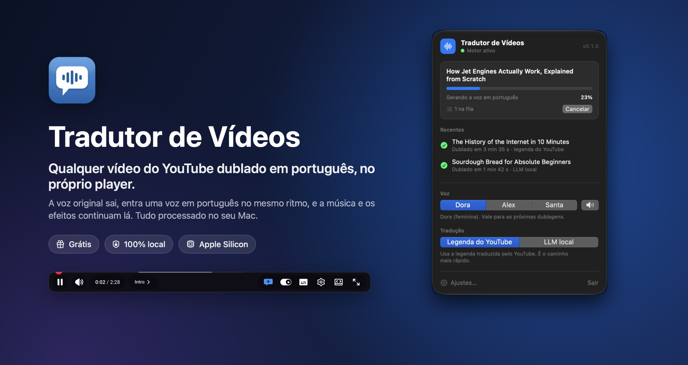
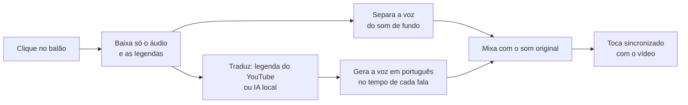
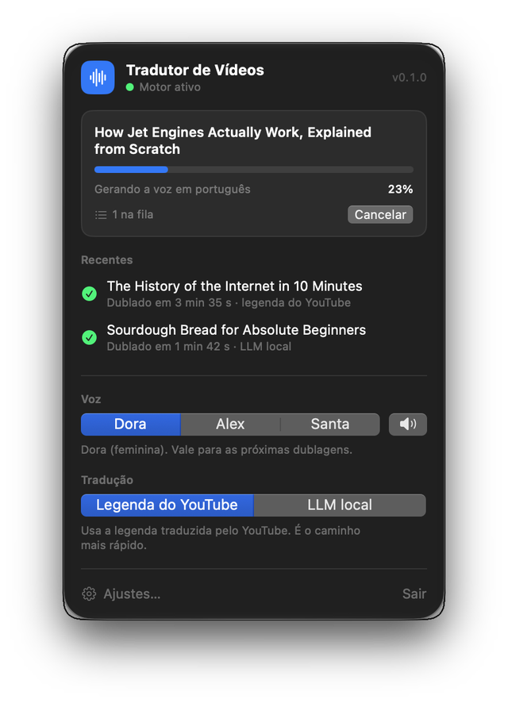
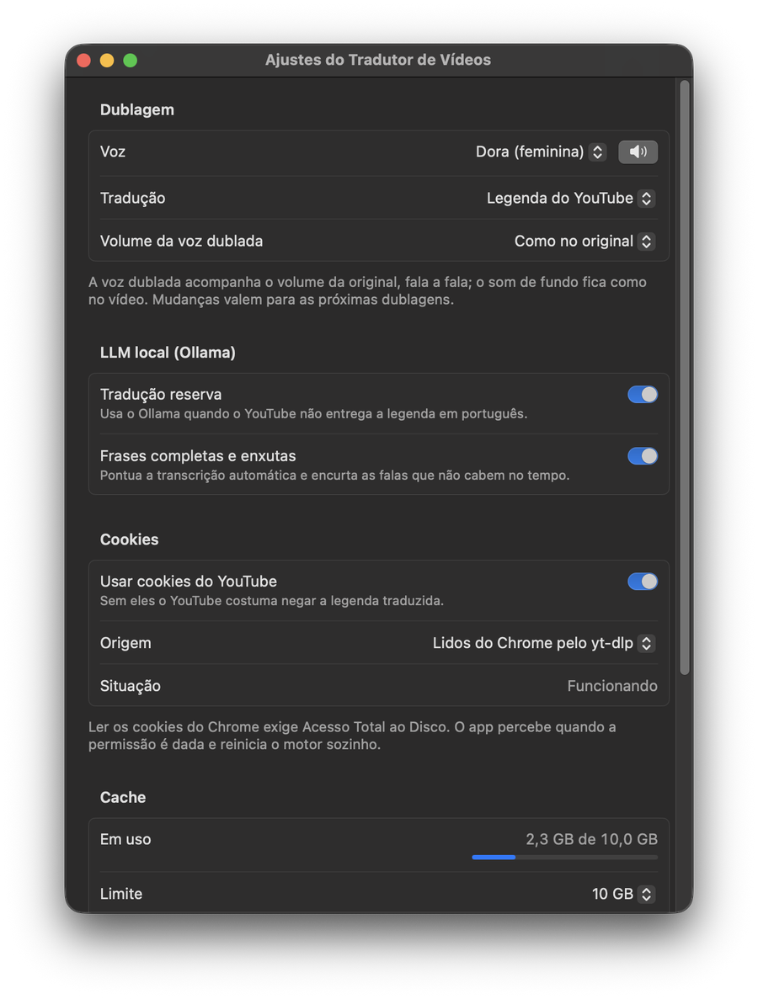
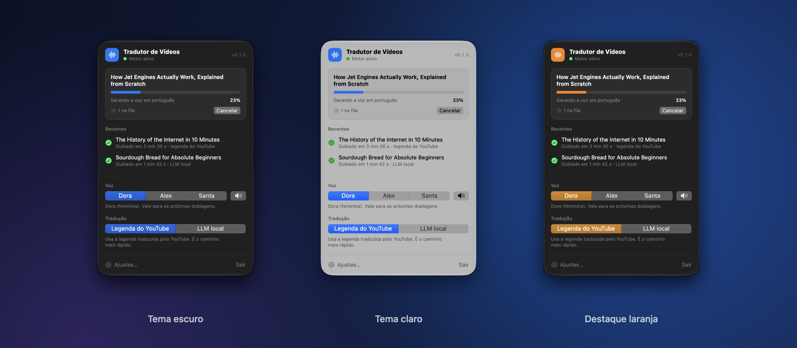

<p align="center">
  
</p>

<p align="center">
  <strong>Um app para a barra de menus do Mac e uma extensão para o Chrome.</strong><br>
  Você clica no balão do player, e em poucos minutos o vídeo está falando português.<br>
  Sem nuvem, sem assinatura, sem chave de API.
</p>

<p align="center">
  
  
  
  
  <a href="LICENSE"></a>
</p>

---

## Por que usar

- **Dublagem de verdade, não legenda.** Você assiste olhando para o vídeo, não para o rodapé.
- **O resto do vídeo continua igual.** Música, efeitos e ambiente ficam; só a voz é trocada, e a nova acompanha o volume da original, fala a fala.
- **Direto no player do YouTube.** Um botão ao lado da legenda. Pause, pule, acelere para 2x: a dublagem acompanha. Um clique volta ao áudio original.
- **Tudo no seu Mac.** Separação de voz, tradução e síntese rodam localmente. Nenhum vídeo é enviado para servidor nenhum.
- **Rápido o bastante.** Num MacBook Pro M1 Max, um vídeo de 13 minutos ficou pronto em 6. Vídeos já dublados abrem na hora.
- **Combina com o seu Mac.** Segue o tema claro ou escuro e a sua cor de destaque, inclusive no botão do YouTube.

## Como funciona

<p align="center">
  
</p>

Você abre um vídeo e clica no balão que aparece nos controles do player. A partir daí:



O balão mostra o progresso em porcentagem e fica colorido quando a dublagem está tocando. Clique de novo para alternar entre dublado e original, ou durante o processamento para cancelar.

## Requisitos

| O quê | Precisa de |
|---|---|
| **Mac** | macOS 14 (Sonoma) ou mais novo. Apple Silicon recomendado; em Mac Intel funciona, mas bem mais devagar. |
| **Navegador** | Google Chrome |
| **Ferramentas** | [Homebrew](https://brew.sh) e as Command Line Tools da Apple com Swift 6 (Xcode 16 ou mais novo). O instalador cuida do resto. |
| **Espaço** | cerca de 1,5 GB (dependências e modelos), mais o cache das dublagens, com limite ajustável (10 GB por padrão) |
| **Opcional** | [Ollama](https://ollama.com), para tradução por IA local e falas mais naturais |

## Instalação

### 1. Baixe o projeto

```bash
git clone https://github.com/arnaldobatista/tradutor-de-videos.git
```

```bash
cd tradutor-de-videos
```

### 2. Rode o instalador

```bash
./install.sh
```

O instalador confere o Mac, instala pelo Homebrew o que faltar (`ffmpeg`, `deno` e `uv`), prepara o motor de dublagem, compila o app e o coloca na pasta **Aplicativos**, já aberto. O ícone aparece na barra de menus. Para atualizar no futuro, é só rodar `git pull` e `./install.sh` de novo.

### 3. Carregue a extensão no Chrome

O Chrome não permite instalar extensões de fora da loja por script, então este passo é manual (uma vez só):

1. Abra `chrome://extensions` e ligue o **Modo do desenvolvedor**, no canto superior direito.
2. Clique em **Carregar sem compactação** e escolha a pasta `extension` do projeto.
3. Abra um vídeo no YouTube e clique no balão nos controles do player.

Na primeira dublagem, o app baixa os modelos de voz e de separação (cerca de 420 MB, uma vez só).

### 4. Opcional: tradução por IA local

Com o [Ollama](https://ollama.com) instalado e um modelo baixado, o app passa a traduzir quando o YouTube não entrega a legenda em português, deixa as falas em frases completas e enxuga as que não caberiam no tempo. Qualquer modelo *instruct* de 7B a 30B serve, por exemplo:

```bash
ollama pull qwen3:8b
```

O app escolhe sozinho o melhor modelo instalado.

<details>
<summary><strong>Instalação manual, sem o script</strong></summary>

```bash
brew install ffmpeg deno uv
```

```bash
cd engine && uv sync && cd ..
```

```bash
./macos/build.sh --install
```

```bash
open "/Applications/Tradutor de Vídeos.app"
```

Depois, carregue a extensão como no passo 3.

</details>

## Usando

### Na barra de menus

<p align="center">
  
</p>

Clique no ícone para ver a dublagem em andamento, com progresso e opção de cancelar, e as dublagens recentes (um clique abre o vídeo). Dali mesmo você troca:

- **Voz**: Dora (feminina), Alex ou Santa (masculinas). O alto-falante toca uma amostra.
- **Tradução**: legenda do YouTube, mais rápida, ou IA local, que respeita melhor o tempo de cada fala.

### Ajustes

<p align="center">
  
</p>

Em **Ajustes…** (⌘,) ficam o volume da voz dublada, as opções do Ollama, os cookies, o cache e a manutenção: reiniciar o motor, atualizar o yt-dlp, abrir os logs e iniciar junto com o Mac.

### Combina com o seu Mac

<p align="center">
  
</p>

O painel e os Ajustes seguem o tema claro ou escuro do macOS e a cor de destaque escolhida em Ajustes do Sistema. O balão no YouTube e o popup da extensão usam a mesma cor.

### No popup da extensão

Clique no ícone da extensão no Chrome para ligar a **dublagem automática** (todo vídeo aberto já começa a dublar), escolher voz e tradução, e limpar o cache.

## De onde vem a tradução

1. **Legenda em português feita pelo autor do vídeo**, quando existe.
2. **Legenda traduzida automaticamente pelo YouTube.** O YouTube costuma recusar essa faixa para quem não está logado, por isso o app usa os seus cookies do `youtube.com`: enviados pela extensão (padrão, sem permissão extra) ou lidos direto do Chrome pelo yt-dlp.
3. **IA local (Ollama)**, quando o YouTube não entrega a legenda em português.

Ler os cookies direto do Chrome exige **Acesso Total ao Disco**, que o macOS só permite ligar em Ajustes do Sistema. O app avisa quando falta a permissão, abre a lista certa e reinicia sozinho quando ela é concedida. Se preferir não conceder, use os cookies enviados pela extensão.

## Privacidade

- Separação de voz, tradução por IA e síntese de voz rodam no seu Mac. Nenhum vídeo, áudio ou texto é enviado para serviços de terceiros.
- O app só acessa a internet para baixar do YouTube o áudio e as legendas do vídeo que você pediu, e para baixar os modelos na primeira dublagem.
- Os cookies do YouTube ficam no seu Mac, com acesso restrito à sua conta de usuário, e nunca vão para os logs.
- O motor só atende conexões do próprio Mac e, vindas do navegador, só as da extensão: nenhum site consegue usá-lo.

## Limitações

- Dubla para **português do Brasil**, a partir de qualquer idioma que tenha legenda no YouTube (feita pelo autor ou automática). Vídeos sem legenda nenhuma e transmissões ao vivo ainda não são suportados.
- Uma voz sintética para todos os falantes; não imita a voz de quem fala.
- A legenda automática do YouTube às vezes erra nomes próprios. A tradução por IA local costuma acertar mais, mas leva mais tempo.
- Só para macOS e testado apenas no Google Chrome.

## Problemas comuns

| Sintoma | O que fazer |
|---|---|
| O balão não aparece no player | Recarregue a aba do YouTube. Confira se a extensão está ligada em `chrome://extensions`. |
| "O motor não está respondendo" | Abra o **Tradutor de Vídeos** em Aplicativos. O ícone precisa estar na barra de menus. |
| "YouTube recusou o vídeo" ou o download falha | Ajustes › **Atualizar yt-dlp**. O YouTube muda com frequência, e o yt-dlp acompanha. |
| A dublagem fica corrida ou atropelada | Troque a tradução para **IA local**, que adapta cada fala ao tempo disponível. |
| Aviso de Acesso Total ao Disco | Siga o botão do aviso ou troque a origem dos cookies para **Enviados pela extensão**. |
| Qualquer outra coisa | Ajustes › **Abrir logs**. O `motor.log` diz em que etapa parou. |

## Desinstalar

1. Clique no ícone da barra de menus e em **Sair**.
2. Remova a extensão em `chrome://extensions`.
3. Apague o app e os dados:

```bash
rm -rf "/Applications/Tradutor de Vídeos.app" \
  ~/Library/Application\ Support/TradutorDeVideos \
  ~/Library/Caches/TradutorDeVideos \
  ~/Library/Logs/TradutorDeVideos
```

Se tiver ligado **Iniciar no login**, desligue antes em Ajustes, ou remova depois em Ajustes do Sistema › Geral › Itens de Início.

## Para desenvolvedores

O projeto tem três partes: um motor em Python que faz a dublagem e expõe uma API local, a extensão do Chrome e o app da barra de menus em Swift. Arquitetura, API, testes e como gerar as imagens estão no [guia de desenvolvimento](docs/DESENVOLVIMENTO.md). O histórico das decisões está no [PLANO.md](PLANO.md).

```bash
cd engine && uv run pytest -q
```

## Feito com

[yt-dlp](https://github.com/yt-dlp/yt-dlp) para o download, [Demucs](https://github.com/facebookresearch/demucs) (via [python-audio-separator](https://github.com/nomadkaraoke/python-audio-separator)) para separar a voz, [Kokoro](https://huggingface.co/hexgrad/Kokoro-82M) (via [kokoro-onnx](https://github.com/thewh1teagle/kokoro-onnx)) para a voz em português, [Ollama](https://ollama.com) para a tradução local, além de FastAPI, SwiftUI e AppKit.

## Aviso

Projeto independente, sem vínculo com o YouTube ou o Google. Feito para uso pessoal: as dublagens ficam só no seu Mac e não devem ser redistribuídas. Respeite os direitos autorais dos criadores e os termos de uso do YouTube.

## Licença

[MIT](LICENSE): use, modifique e distribua à vontade, mantendo o aviso de copyright. Os componentes de terceiros listados em "Feito com", incluindo os modelos de voz e de separação baixados na primeira dublagem, seguem as próprias licenças.
