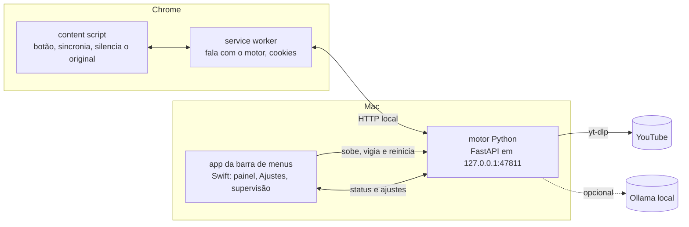

# Guia de desenvolvimento

Como o Tradutor de Vídeos é montado por dentro, como rodar cada parte isoladamente e como testar. Para instalar e usar, veja o [README](../README.md). As decisões de projeto e o histórico estão no [PLANO.md](../PLANO.md).

## Arquitetura



| Pasta | Conteúdo |
|---|---|
| `engine/` | Motor em Python 3.12 (uv). `src/dublador/pipeline/` tem uma etapa por arquivo: `download`, `segment`, `punctuate`, `translate`, `separate`, `tts`, `fit`, `mix`, e `run` orquestra. `server.py` é a API; `jobs.py`, a fila. |
| `extension/` | Extensão MV3 em JavaScript puro, sem build. `e2e/` tem o teste de ponta a ponta com Playwright. |
| `macos/` | App SwiftUI/AppKit (SwiftPM). `build.sh` monta, assina e instala o `.app`. `icon/make_icon.py` gera o ícone do app e os da extensão. |
| `docs/` | Este guia e as imagens do README. |
| `spikes/` | Experimentos da fase de validação (benchmark de separação, TTS, legendas). |

## Motor

```bash
cd engine && uv sync
uv run dub "https://www.youtube.com/watch?v=5C_HPTJg5ek"   # dubla pela linha de comando e imprime o relatório
uv run python -m dublador.server                           # sobe só a API (o app faz isso sozinho)
```

### Pipeline

1. **Download**: yt-dlp baixa só a faixa de áudio e as legendas em `json3` (a faixa original e a traduzida para português).
2. **Falas**: as legendas viram falas por frase completa. Na transcrição automática, que vem sem pontuação, o Ollama restaura a pontuação; a legenda do YouTube já traduzida é cortada pela própria pontuação.
3. **Tradução**: legenda manual em português, senão a faixa traduzida do YouTube, senão o Ollama. O Ollama também enxuga as falas que não cabem no tempo.
4. **Separação** (em paralelo com 2 e 3): `htdemucs` separa a voz do fundo.
5. **Voz**: Kokoro (ONNX) sintetiza cada fala; a velocidade sobe só o necessário (até 1,4x) e o atraso acumulado tem teto de 1,2 s.
6. **Mixagem**: a voz dublada copia o volume da original fala a fala, o fundo fica intocado e a mix respeita −14 LUFS, como o YouTube. Sai um `m4a`.

Cada vídeo fica em `~/Library/Caches/TradutorDeVideos/<id>/`; `report.json` e `falas.json` mostram tempos, velocidades e ganhos de cada fala.

### API (127.0.0.1:47811)

| Rota | Função |
|---|---|
| `GET /health` | versão e saúde |
| `GET /status` | job atual, fila, recentes, cache, cookies, ajustes e vozes |
| `POST /jobs` `{video_id}` | cria (ou reaproveita do cache) a dublagem |
| `GET /jobs/{id}` · `DELETE /jobs/{id}` | progresso · cancelar |
| `GET /jobs/{id}/audio` | o `m4a` dublado, com suporte a `Range` |
| `GET/PUT /settings` | ajustes, validados e gravados em `settings.json` |
| `GET /voices/{voz}/sample` | amostra curta da voz (gerada uma vez) |
| `PUT/DELETE /cookies` | cookies do `youtube.com` enviados pela extensão (gravados com permissão `0600`) |
| `POST /cache/clear` | apaga as dublagens guardadas |

O motor só escuta em `127.0.0.1`, valida o header `Host` (contra DNS rebinding) e só aceita requisições de navegador vindas do ID fixo da extensão (`ilmjfenckbenkgighlfojdejdoiiflmo`, derivado da chave em `extension/manifest.json`). Requisições sem `Origin`, como as do app, são aceitas.

### Onde ficam os arquivos

| O quê | Onde |
|---|---|
| Ajustes, cookies, modelos, amostras de voz | `~/Library/Application Support/TradutorDeVideos/` |
| Cache das dublagens | `~/Library/Caches/TradutorDeVideos/` |
| Logs (`motor.log`, `motor-stdout.log`, `atualizar-yt-dlp.log`) | `~/Library/Logs/TradutorDeVideos/` |

## App da barra de menus

```bash
cd macos && ./build.sh             # monta build.noindex/Tradutor de Vídeos.app
cd macos && ./build.sh --install   # e copia para /Applications (ou TDV_INSTALL_DIR)
```

- **Supervisão do motor.** Se já houver um motor respondendo na porta, o app o adota. Senão, sobe `engine/.venv/bin/python -m dublador.server` com o Homebrew no `PATH`. Se o motor cair, religa com espera crescente (1, 2, 4, 8 s) e desiste depois de 5 quedas em 60 s. Ao sair, manda SIGTERM ao motor e SIGKILL 3 s depois; um processo vigia garante que o motor nunca sobrevive ao app.
- **Painel.** `StatusPanelController` usa um `NSStatusItem` e um `NSPanel` próprios, e não o `MenuBarExtra`: o painel fica preso logo abaixo do ícone e só a borda de baixo se mexe quando o conteúdo muda de altura. No macOS 26+ o fundo é `NSGlassEffectView`, e a janela tem barra de título invisível para o contorno do sistema acompanhar o canto arredondado do vidro (raio 26).
- **Tema.** Os controles usam `NSColor.controlAccentColor` de forma explícita. O app publica essa cor no motor (`ui_accent`) e a extensão a usa no botão do YouTube e no popup.
- **Assinatura.** Sem identidade, a assinatura é ad-hoc e muda a cada build, e o macOS descarta as permissões dadas ao app (como o Acesso Total ao Disco). Grave o nome de uma identidade em `macos/.sign-identity` (fora do git; liste as suas com `security find-identity -v -p codesigning`) ou passe `TDV_SIGN_IDENTITY`.
- **Variáveis de teste.** `TDV_PORT` troca a porta do motor e `TDV_ENGINE_DIR`, a pasta do motor.

### Visual e automação

```bash
macos/.build/release/TradutorBar --snapshot /tmp/telas              # PNGs do painel e dos Ajustes, claro e escuro
macos/.build/release/TradutorBar --debug-hooks --preview dublando   # instância de demonstração, sem motor
```

Com `--debug-hooks`, o app atende à notificação distribuída `local.arnaldo.tradutordevideos.debug` com `open`, `close` e `settings`, para testes abrirem a interface sem mouse. As imagens do README saíram da instância de demonstração, capturadas com `screencapture -l`; `-AppleAccentColor 4` e `-NSRequiresAquaSystemAppearance YES` trocam a cor de destaque e o tema só para aquele processo.

## Extensão

- `background.js` é o único ponto que fala com o motor: envia os cookies antes de cada dublagem, repassa o progresso e entrega o áudio em blocos (`Range`) para o content script montar um `blob:`.
- `content.js` põe o botão em `.ytp-right-controls` e passa o `<video>` por um `GainNode` para silenciar o original sem mexer no volume do YouTube. A sincronia mede o desvio a cada 500 ms: acima de 0,3 s pula, entre 0,05 e 0,3 s corrige com um ajuste fino de velocidade. Anúncios pausam a dublagem, e a navegação entre vídeos zera tudo.
- `popup.html`/`popup.js`: dublagem automática, envio de cookies, voz, tradução e cache.

## Testes

```bash
cd engine && uv run pytest -q
cd extension/e2e && npm install && npx playwright install chromium && npm test
```

O teste de ponta a ponta sobe um Chromium com a extensão, dubla um vídeo de verdade e confere botão, cor, silenciamento, sincronia (normal, depois de pular, em 2x), pausa, alternância e navegação. Ele precisa do motor no ar. O YouTube só entrega o primeiro minuto de cada vídeo a esse navegador automatizado, então dublagens novas e demoradas podem falhar na etapa de reprodução; com a dublagem em cache, o teste roda inteiro.
